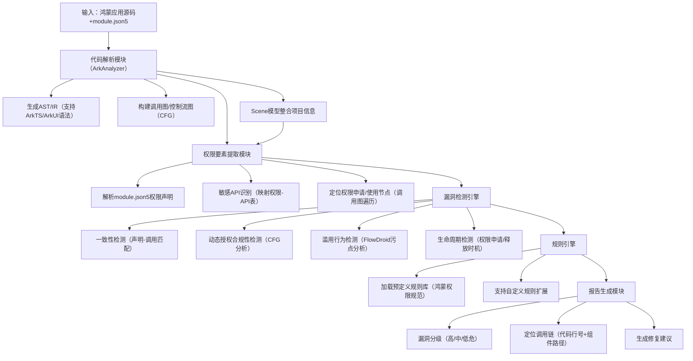

# 实施计划

## 项目背景

随着智能终端设备向全场景互联方向发展，OpenHarmony 作为由开放原子开源基金会孵化的开源操作系统项目，致力于构建覆盖手机、平板、智能家居、车载设备等多终端的统一生态体系。


为满足该生态下高性能、高可靠性应用的开发需求，ArkTS 语言应运而生——它在 TypeScript 基础上进行扩展，引入声明式 UI 框架 ArkUI、响应式数据绑定、严格静态类型约束等特性，显著提升了开发效率和代码运行性能。然而，ArkTS的独特设计（如 @Entry/@Component 装饰器定义的组件结构、嵌套系统组件的调用方式、禁止动态类型“any”等语法约束）导致传统 JavaScript/TypeScript 静态分析工具（如 ESLint、TAJS）因语法节点不识别、结构解析错误等问题无法有效处理其代码，70%以上的真实 ArkTS 文件会引发现有工具的“Parsing error”，使得代码中的性能瓶颈（如UI组件冗余实例化）、安全漏洞（如敏感API未授权调用）、类型不匹配等问题难以被自动化检测，严重制约了鸿蒙应用的开发效率和质量保障。  

在成熟的移动生态（如 Android）中，静态分析框架（如 Soot）为代码优化和安全审计提供了关键支撑，但 OpenHarmony 生态此前缺乏针对 ArkTS 的专用框架。为此，OpenHarmony 社区孵化了方舟分析器（ArkAnalyzer），这是首个面向 ArkTS 语言的静态分析底座。该框架通过定制化抽象语法树（AST）建模 ArkTS 特有的语法结构（如 ArkUI 组件树、装饰器语义），将嵌套组件调用转换为三地址代码以解决结构不匹配问题，并集成控制流图（CFG）构建、调用图分析（支持 CHA/RTA 算法，准确率分别达93.75%和87.95%）、类型推断等基础能力，为上层分析工具提供高效且准确的中间表示（IR）。实验数据显示，其分析千行代码的调用图耗时可控制在 1 秒内，满足工业级开发场景对效率的严苛要求。  

基于 ArkAnalyzer 的鸿蒙应用程序分析工具旨在解决上述痛点：通过深度利用其代码表示与转换能力，识别 ArkUI 组件的不当使用导致的渲染性能问题，追踪敏感数据在跨组件流转中的泄露路径，检测违反静态类型约束的潜在缺陷；同时，工具支持与 IDE 和 CI/CD 管道集成，在代码编写和构建阶段实时反馈问题，将传统依赖人工排查的低效流程转化为自动化分析，显著降低开发者在性能优化、安全审计和代码质量提升上的成本。随着鸿蒙生态的快速发展，此类工具不仅能提升单个应用的可靠性，更能通过建立统一的代码分析标准，推动整个生态在开发效率、应用质量和安全性上的标准化进程，为 OpenHarmony 从技术验证阶段迈向规模化应用提供关键支撑。

## 现状分析

#### 安卓应用权限管理的演进与局限

安卓系统的权限管理历经多次迭代，从早期的静态全量授权（Android 6.0 前）逐步过渡到动态权限模型（Android 6.0+），并在 Android 12 中引入精确位置、麦克风 / 摄像头使用提示等强化措施。

然而，传统检测工具（如 FlowDroid、IccTA）在应对安卓应用时仍存在以下瓶颈：动态特性处理不足，反射调用、JNI 接口等动态行为导致静态分析工具难以精准追踪敏感数据流向，例如通过`Class.forName()`动态加载类可能绕过权限检查；跨组件分析缺陷，基于 Intent 的组件间通信（如 Activity 跳转）可能引发权限越界，但现有工具对跨组件数据流的追踪精度有限，尤其在处理隐式 Intent 时易产生误判；开发者习惯影响，部分开发者仍沿用 “权限组” 申请模式（如申请`ACCESS_FINE_LOCATION`时自动获得`ACCESS_COARSE_LOCATION`），导致权限过度申请问题普遍存在。

#### 鸿蒙分布式权限体系的新范式

鸿蒙系统的权限管理以 “全场景、分布式” 为核心，其架构与安卓存在显著差异：分级权限模型，包括普通权限（如网络访问、振动）、敏感权限（如位置、相机）和分布式权限（跨设备数据访问需同时获取本地设备的 “跨设备通信” 权限和目标设备的对应权限）；原子化服务权限隔离，原子化服务作为轻量级应用，其权限与宿主应用隔离，需独立申请，例如天气服务需单独声明`ohos.permission.LOCATION`，避免宿主应用越权访问；声明式 UI 的隐式权限依赖，ArkUI 通过装饰器（如`@State`）管理组件状态，可能引入隐式权限依赖，例如`@State`变量跨组件传递时若未显式声明权限，可能导致数据泄露风险。

#### 现有检测技术的适配困境

安卓工具的不适用性，ArkTS 的`struct`、装饰器（如`@Entry`、`@Component`）等新语法导致 FlowDroid 等工具无法正确构建抽象语法树（AST），且鸿蒙的分布式 API（如`DistributedDataManager`）与安卓的组件模型（如`Activity`）差异显著，传统工具无法识别跨设备数据流动；鸿蒙专用工具的缺失，尽管 ArkAnalyzer 提供了控制流图（CFG）、调用图（CG）构建等基础能力，但未集成针对权限滥用的检测逻辑，需进一步扩展；动态检测覆盖有限，沙箱环境难以模拟真实分布式场景，例如设备间信任关系的建立与数据加密传输的动态变化；开发者生态的挑战，安卓开发者可能沿用传统权限申请逻辑，忽视鸿蒙的分布式特性，导致权限设计缺陷，且鸿蒙应用数量较少，权限滥用案例尚未被系统研究，导致检测模型训练困难。

#### 隐私保护与合规要求的新挑战

跨设备数据安全方面，鸿蒙通过 PIN 码、碰一碰等方式建立设备信任关系，但攻击者可能伪造设备身份窃取数据，尽管采用端到端加密（如`SecurityKeyStore`），但静态分析工具难以解析加密后的数据路径；合规性压力方面，GDPR 与 CCPA 要求应用明确告知用户权限使用目的，并提供数据删除接口，国内《个人信息保护法》要求最小权限原则，需检测应用是否申请与核心功能无关的权限；隐私保护技术的应用方面，差分隐私通过添加噪声实现数据分析与隐私保护的平衡，联邦学习在保护数据隐私的前提下实现跨设备模型训练，但现有工具尚未有效整合这些技术。

#### 生态现状与工具集成需求

应用市场审核机制日益严格，华为应用市场要求应用必须通过静态分析工具（如 ArkAnalyzer）检测潜在风险，若检测到敏感 API（如`ohos.security.SystemCapability`）的未授权使用，将直接驳回应用上架；开发者工具集成方面，需将权限检测工具（如 ArkPermission）集成到 IDE（如 DevEco Studio）中，提供实时代码分析和修复建议，并在 CI/CD 流水线中自动触发权限检测；用户隐私意识提升，鸿蒙用户对隐私保护的关注度显著提高，应用权限透明度成为下载决策的重要因素，华为推出 “纯净模式”，默认禁止安装未通过安全检测的应用，倒逼开发者优化权限设计。

#### 研究空白与本项目定位

现有技术在鸿蒙权限滥用检测领域存在以下空白：分布式场景的深度分析，缺乏对设备间数据流动路径的追踪能力，无法识别跨设备权限越界；声明式 UI 的语义解析，无法解析 ArkUI 装饰器对权限的影响，导致隐式权限依赖难以检测；多维度合规性验证，未整合 GDPR、《个人信息保护法》等法规要求，无法自动生成合规报告。ArkPermission 框架将针对上述挑战，基于 ArkAnalyzer 扩展分布式权限检测模块，实现跨设备数据流追踪（结合设备信任关系与加密传输协议，构建跨设备调用图）、声明式 UI 语义分析（解析`@State`、`@Component`等装饰器的权限依赖，识别隐式数据泄露风险）、合规性自动化验证（内置国内外隐私法规规则库，自动生成权限使用合规性报告），填补鸿蒙权限滥用检测的技术空白，为开发者提供高效、精准的工具支持，同时推动鸿蒙生态的安全性与合规性建设。

## 设计方案

### 一、核心技术框架设计



#### 基于 ArkAnalyzer 的代码解析与中间表示构建

首先获取ArkTS 编写的鸿蒙应用源码（含 module.json5 权限声明文件），然后执行如下动作：

- **AST 与 IR 生成**：利用 ArkAnalyzer 的**Code Representation 模块**解析 ArkTS 代码，生成抽象语法树（AST）和中间表示（IR），支持 ArkUI 装饰器（如`@Component`、`@Entry`）和权限相关 API（如`ohos.security.permission`）的语义解析。
- **场景建模**：通过`Scene`模型整合项目级信息，包括类层次结构、命名空间、方法调用关系（调用图），重点提取权限声明（`module.json5`中的`reqPermissions`字段）和敏感 API 调用节点（如`requestPermissions`、`getUserMedia`）。

#### 权限相关要素提取

- 权限声明解析
  - 从`module.json5`中提取应用声明的权限列表，区分`system_grant`（系统授权）和`user_grant`（用户授权），记录权限等级（APL：`system_basic`/`system_core`）。
  - 建立权限 - API 映射表：关联鸿蒙 API（如`ohos.app.ability.Ability.requestPermissions`）与对应权限（如`ohos.permission.CAMERA`）。
- 敏感操作识别
  - 通过 ArkAnalyzer 的**Call Graph Construction**（CHA/RTA 算法）定位所有敏感 API 调用点，如摄像头（`Camera.open()`）、麦克风（`Microphone.start()`）、位置信息（`LocationManager.getLocation()`）等。
  - 识别权限申请逻辑：检测`requestPermissions`调用路径及用户授权处理分支（如`onRequestPermissionsResult`回调）。

#### 权限检测核心算法

结合安卓权限检测经典算法（如数据流分析、污点传播）与鸿蒙特性，实现以下检测逻辑：

##### （1）权限 - API 一致性检测

- **规则**：未声明权限的敏感 API 调用视为漏洞（如未声明`CAMERA`权限却调用`Camera.open()`）。
- 实现
  - 构建 “声明权限集合” 与 “调用敏感 API 所需权限集合” 的映射关系。
  - 通过调用图遍历所有敏感 API 节点，检查其父调用链是否包含对应的权限声明或动态申请逻辑。

##### （2）动态授权流程合规性检测

- **规则**：`user_grant`权限必须通过`requestPermissions`动态申请，且用户授权后才能使用；禁止静默获取用户授权权限。
- 实现
  - 利用控制流图（CFG） 分析`requestPermissions`调用与敏感 API 调用的顺序关系，检测是否存在 “未申请直接调用” 或 “申请未通过即调用” 的路径。
  - 追踪`onRequestPermissionsResult`回调中的权限状态（`PERMISSION_GRANTED`/`PERMISSION_DENIED`），确保敏感操作仅在授权通过后执行。

##### （3）权限滥用行为检测

- 过度授权检测
  - 检测应用是否申请与功能无关的权限（如计算器应用申请`CAMERA`权限），可通过预定义的 “权限 - 功能” 合规表（如基于鸿蒙官方权限分类）实现。
- 权限提升攻击检测
  - 利用**跨过程数据流分析**（IFDS 算法，ArkAnalyzer 已支持）追踪`ACL`权限的使用，检测低 APL 应用通过 ACL 申请高等级权限时是否存在逻辑漏洞（如未严格校验用户场景）。
- 敏感数据流向检测
  - 借鉴安卓 FlowDroid 的**污点分析**思路，将权限获取视为 “污点源”，追踪权限与敏感数据（如摄像头捕获图像、位置坐标）的流向，检测是否存在权限获取后的数据非法传播（如上传未加密的用户位置信息）。

##### （4）权限生命周期管理检测

- 检测权限申请时机是否合理（如启动时批量申请无关权限）。
- 检查权限释放逻辑（如`onDestroy`中是否关闭敏感设备句柄），防止权限持有超时。

### 二、系统架构设计

#### 模块划分

```
ArkPermission框架
├─ 代码解析模块（基于ArkAnalyzer）
│  ├─ AST/IR生成（支持ArkTS/ArkUI语法）
│  ├─ 调用图/控制流图构建
│  └─ 场景模型（Scene）与项目信息整合
├─ 权限要素提取模块
│  ├─ module.json5权限声明解析
│  ├─ 敏感API识别与映射（API-权限关联表）
│  └─ 权限申请/使用节点定位
├─ 漏洞检测引擎
│  ├─ 一致性检测（声明-调用匹配）
│  ├─ 动态授权合规性检测（控制流分析）
│  ├─ 滥用行为检测（数据流/污点分析）
│  └─ 权限生命周期检测
├─ 规则引擎
│  ├─ 预定义规则库（鸿蒙权限规范）
│  ├─ 自定义规则接口（支持开发者扩展）
│  └─ 规则匹配引擎
└─ 报告生成模块
   ├─ 漏洞分级（高/中/低危）
   ├─ 调用链定位（含代码行号、组件路径）
   └─ 修复建议（如补充权限声明、增加授权逻辑）
```

#### 关键技术适配

- **鸿蒙 APL 等级校验**：在权限声明解析阶段，验证应用 APL 等级与申请权限的匹配性，检测通过 ACL 申请高权限的场景是否符合最小必要原则。
- **ArkUI 组件权限关联**：针对 ArkUI 声明式 UI 中的组件（如`CameraComponent`），通过装饰器（`@PermissionRequired`）解析其依赖的权限，建立 “UI 组件 - 权限” 映射关系，检测未声明依赖权限的组件使用。

### 三、权限检测算法借鉴与改造

#### 安卓经典算法适配

| **安卓算法**          | **鸿蒙改造方案**                                             |
| --------------------- | ------------------------------------------------------------ |
| FlowDroid（污点分析） | 定义鸿蒙敏感 API 为 “污点源”，追踪权限获取后的数据流，检测权限与敏感数据的非法关联（如位置权限→上传服务器未加密）。 |
| IccTA（组件间通信）   | 分析鸿蒙 Ability/Service 间的跨组件权限传递，检测跨组件调用时是否携带有效权限令牌（TokenID）。 |
| 权限依赖图（PDG）     | 构建鸿蒙 “权限 - API - 组件” 依赖图，通过图遍历检测权限滥用路径（如未授权组件调用敏感 API）。 |

#### 鸿蒙特有场景处理

- **ACL 权限跨等级申请**：在调用图中标记通过 ACL 申请的权限节点，分析其调用链是否经过严格的安全校验（如用户确认弹窗、生物识别）。
- **多用户 / 应用分身隔离**：根据 TokenID 区分不同用户 / 分身的权限状态，检测权限在不同身份间的越界访问。

### 四、实验与验证

#### 数据集构建

- **基准测试集**：包含合规与违规的鸿蒙应用案例（如未声明权限调用、动态授权缺失、ACL 滥用），可从 OpenHarmony 官方示例和公开漏洞库（如 CNVD）中提取。
- **真实应用数据集**：爬取华为应用市场中高下载量应用，通过 ArkAnalyzer 解析后作为测试样本。

#### 评估指标

- **检测准确率**：正确检测的漏洞数 / 实际漏洞数（对比人工审计结果）。
- **误报率**：错误检测的漏洞数 / 检测结果总数。
- **性能**：分析千行代码的耗时（参考 ArkAnalyzer 性能，目标控制在 10 秒内）。

## 关键技术

本项目围绕鸿蒙应用系统权限检测的核心需求，依托方舟分析器（ArkAnalyzer）的静态分析能力，结合鸿蒙生态特性设计了多层级技术架构，形成以下关键技术体系：  

### 基于ArkAnalyzer的多维度代码解析技术

项目构建了适配 ArkTS/ArkUI 语法的代码解析模块，通过 ArkAnalyzer 的 Code Representation 模块实现语义增强的 AST/IR 生成与场景建模。针对ArkTS特有的声明式UI装饰器和权限相关 API，扩展抽象语法树节点定义，精准解析权限声明语义与敏感操作调用逻辑，生成的中间表示支持嵌套组件调用转换为三地址代码。通过`Scene`模型整合项目级信息，构建类层次结构、命名空间及方法调用图，重点提取权限声明范围与敏感 API 调用节点的映射关系，为跨模块权限流转分析奠定基础。

### 权限要素精准提取与映射技术

设计了针对鸿蒙权限体系的要素提取机制，实现声明、调用、组件的多维度关联。从`module.json5`中提取权限声明信息，区分授权类型，记录权限等级，建立“权限 - API映射表”。利用 ArkAnalyzer 的调用图遍历技术，识别所有权限相关操作节点，包括权限申请逻辑、用户授权处理及敏感功能调用，确保权限生命周期各环节的全覆盖检测。

### 多层级权限检测引擎技术

融合经典静态分析算法与鸿蒙特性，构建一致性检测、动态授权合规性检测、滥用行为检测和生命周期管理检测四维度逻辑。通过调用图遍历验证权限声明与敏感API调用的匹配性，基于控制流图分析动态授权流程合规性，借鉴污点分析思路检测权限滥用行为，聚焦权限申请时机与释放逻辑，保障权限使用的时效性与最小必要性。

### 鸿蒙特性适配与规则扩展技术  

针对鸿蒙生态的独特场景设计专用检测逻辑，在权限声明解析阶段，验证应用APL等级与申请权限的匹配性，结合ACL机制检测跨等级权限申请场景。通过解析ArkUI组件装饰器，建立“UI组件 - 权限”映射关系，检测声明式UI中未声明依赖权限的组件使用。集成预定义规则库与自定义规则接口，支持开发者根据行业需求扩展检测逻辑。

### 跨平台算法改造与性能优化技术

对安卓经典权限检测算法进行鸿蒙适配，平衡检测精度与效率。重新定义鸿蒙敏感API为“污点源”，调整数据流追踪策略，构建“权限 - 组件 - API”依赖图检测跨组件权限传递。继承ArkAnalyzer的高效中间表示与增量分析机制，确保千行代码级应用的权限检测耗时满足CI/CD管道的实时性要求。

上述关键技术突破了传统静态分析工具对ArkTS语法的解析局限，构建了覆盖“声明 - 申请 - 使用 - 释放”的全周期权限检测体系，既实现了对鸿蒙APL等级、ACL权限等特有机制的深度适配，又通过弹性规则引擎支持未来权限规范的动态扩展。项目技术不仅为开发者提供了精准的权限漏洞定位能力，更通过标准化检测流程推动鸿蒙生态权限管理的合规化、智能化，成为全场景设备互联时代系统安全性的核心技术支撑。 

## 效果呈现

## 应用前景

本项目聚焦鸿蒙应用系统权限检测，依托方舟分析器（ArkAnalyzer）的静态分析能力，构建覆盖权限声明、使用及流转的全周期防护体系，成为鸿蒙生态权限安全的核心基础设施。通过自动化检测未声明权限使用、过度权限申请及滥用风险，项目从代码源头阻断权限相关安全漏洞，推动开发者遵循 “最小必要” 原则，确保权限申请与功能需求精准匹配。工具深度适配 OpenHarmony 权限管理规范，将传统人工审计转化为智能化分析，显著降低权限合规成本，为中小开发者提供普惠性安全保障。

在生态层面，项目通过标准化检测能力建立统一的权限安全基线，助力应用市场从入口端过滤权限滥用风险，提升用户对鸿蒙应用的信任度。随着鸿蒙设备向车载、金融等敏感领域拓展，本项目构建的权限风险评估模型与动态流转追踪技术，将成为关键场景安全合规的核心支撑，为生态在高安全要求领域的规模化应用奠定基础。项目的价值不仅在于单点漏洞检测，更在于通过技术赋能推动权限管理标准化，形成 “检测 — 修复 — 生态反馈” 的闭环，助力鸿蒙生态在数据安全与隐私保护上构建差异化竞争力，成为全场景设备互联时代的可信开发基石。
